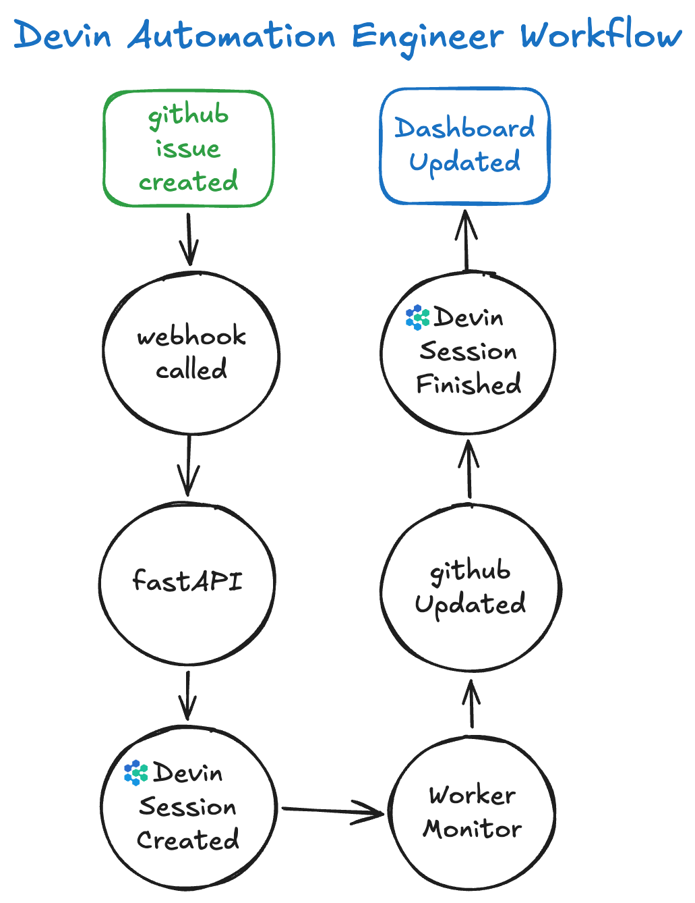

# Devin Automation Engineer Workflow

## Overview

Engineering teams spend significant time on repetitive maintenance work such 
as dependency upgrades, security fixes, and code quality improvements. This 
project automates that workflow by integrating GitHub with Devin through an 
event-driven architecture. When an issue is created, the system 
automatically launches a Devin session to investigate and remediate the 
problem, monitors its progress, and reports the results back to the 
development team. A built-in dashboard provides real-time visibility into 
active tasks, completed remediations, and overall system performance, 
demonstrating how autonomous coding agents can become practical participants 
in existing engineering workflows.

## How to Run

### Requirements

- Docker
- Docker Compose
- GitHub Personal Access Token with `repo` scope
- Devin Org ID (https://app.devin.ai/org/{your-org-name}/settings/devin-api)
- Devin Service User Token (https://app.devin.ai/org/{your-org-name}/settings/devin-api)
- Ngrok (for webhook testing)

### Setup (Local Development)

1. Clone the repository
2. Copy `.env.example` to `.env` and fill in the values
3. Run `docker-compose up --build` to build and start the services
4. Confirm the dashboard at `http://localhost:8000/dashboard`
5. Run `ngrok http 8000` to expose the dashboard to the internet

### Choose a GitHub Repository

1. To simplify, fork a repository or use an existing one (e.g., I forked 
   this one: https://github.com/tvieira/superset)
2. Add the webhook URL from ngrok to the repository settings (don't forget to add the 
   `/webhook` path, the `application/json` content type, the `issues` event, and the 
   github webhook secret you defined in the `.env` file)
3. Configure the webhook to trigger on issue creation

### Configure Devin to work with your repository

1. Go to your Devin account at [https://app.devin.ai]
2. At [https://app.devin.ai/settings/connections](Settings / Connection) 
   configure Github connection and allow Devin to write to your repository

## How it works

### Usage

1. Create an issue in the GitHub repository
2. The system will automatically launch a Devin session to investigate and remediate the problem
3. Monitor the progress in the dashboard (http://localhost:8000/dashboard)
4. Review the results and merge the pull request if needed

## Future Enhancements

- Retry failed sessions
- Support additional GitHub events
- Add an additional Devin action to review the pull request (e.g., check if the changes are correct, CI checks pass)
- Session prioritization
- Session timeout management
- Session ACU limiting
- Multiple worker processes
- PostgreSQL backend
- Authentication for dashboard access / use of Grafana + Prometheus
- Slack or Teams notifications